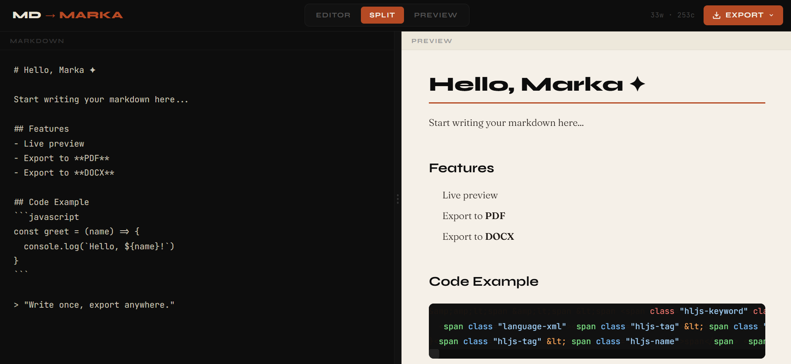

# Marka ✦

> A beautiful, minimalist Markdown editor with live preview and one-click export to PDF and DOCX — built with SvelteKit and hosted on Cloudflare Pages.



## ✨ Features

- **Live Preview** — see your markdown rendered in real time as you type
- **Split / Editor / Preview** modes — switch between layouts with one click
- **Export to PDF** — clean A4 output with beautiful typography
- **Export to DOCX** — proper Word document with styled headings, lists, tables, and inline formatting
- **Syntax Highlighting** — code blocks highlighted via highlight.js
- **Drag to Resize** — adjust the editor and preview pane widths freely
- **Keyboard Shortcuts** — `Ctrl+Shift+D` for PDF, `Ctrl+Shift+W` for DOCX
- **Word & Character Count** — live stats in the toolbar
- **Tab Support** — press Tab inside the editor for indentation
- **Zero backend** — 100% client-side, no server required

## 🛠 Tech Stack

| Layer               | Technology                                              |
| ------------------- | ------------------------------------------------------- |
| Framework           | [SvelteKit](https://kit.svelte.dev)                     |
| Styling             | [Tailwind CSS](https://tailwindcss.com)                 |
| Markdown Parser     | [marked](https://marked.js.org)                         |
| Syntax Highlighting | [highlight.js](https://highlightjs.org)                 |
| PDF Export          | [html2pdf.js](https://github.com/eKoopmans/html2pdf.js) |
| DOCX Export         | [docx](https://docx.js.org)                             |
| Hosting             | [Cloudflare Pages](https://pages.cloudflare.com)        |

## 🚀 Getting Started

### Prerequisites

- Node.js 18+
- npm

### Installation

```bash
# Clone the repo
git clone https://github.com/yourusername/marka.git
cd marka

# Install dependencies
npm install

# Start the dev server
npm run dev
```

Open [http://localhost:5173](http://localhost:5173) in your browser.

### Build for Production

```bash
npm run build
npm run preview
```

## ☁️ Deploy to Cloudflare Pages

### Option 1 — Connect via Git (recommended)

1. Push your repo to GitHub
2. Go to [Cloudflare Pages](https://pages.cloudflare.com) → **Create a project**
3. Connect your GitHub repository
4. Set the build settings:

| Setting                | Value                    |
| ---------------------- | ------------------------ |
| Framework preset       | SvelteKit                |
| Build command          | `npm run build`          |
| Build output directory | `.svelte-kit/cloudflare` |

5. Click **Save and Deploy** ✅

### Option 2 — Deploy via CLI

```bash
# Install Wrangler
npm install -g wrangler

# Login to Cloudflare
wrangler login

# Build and deploy
npm run build
wrangler pages deploy .svelte-kit/cloudflare --project-name=marka
```

### Cloudflare Adapter

Make sure you have the Cloudflare adapter installed:

```bash
npm install -D @sveltejs/adapter-cloudflare
```

And update `svelte.config.js`:

```js
import adapter from '@sveltejs/adapter-cloudflare';

export default {
	kit: {
		adapter: adapter()
	}
};
```

## 📁 Project Structure

```
marka/
├── src/
│   ├── lib/
│   │   ├── components/
│   │   │   ├── Editor.svelte       # Markdown textarea input
│   │   │   ├── Preview.svelte      # Live rendered preview
│   │   │   ├── Toolbar.svelte      # Tabs + export dropdown
│   │   │   └── ExportMenu.svelte   # PDF / DOCX dropdown
│   │   ├── utils/
│   │   │   ├── pdfExport.js        # html2pdf export logic
│   │   │   └── docxExport.js       # docx generation logic
│   │   └── stores/
│   │       └── editor.js           # Svelte stores (markdown, activeTab)
│   ├── routes/
│   │   ├── +layout.svelte          # Global layout
│   │   └── +page.svelte            # Main page
│   └── app.html                    # HTML shell
├── static/
├── svelte.config.js
├── tailwind.config.js
└── vite.config.js
```

## ⌨️ Keyboard Shortcuts

| Shortcut           | Action                 |
| ------------------ | ---------------------- |
| `Ctrl + Shift + D` | Export as PDF          |
| `Ctrl + Shift + W` | Export as DOCX         |
| `Tab`              | Indent (inside editor) |

## 🤝 Contributing

Contributions are welcome! Feel free to open an issue or submit a pull request.

1. Fork the repo
2. Create your branch: `git checkout -b feature/your-feature`
3. Commit your changes: `git commit -m 'add your feature'`
4. Push to the branch: `git push origin feature/your-feature`
5. Open a Pull Request

## 📄 License

MIT License — see [LICENSE](LICENSE) for details.

---

Made with ☕ and Svelte
